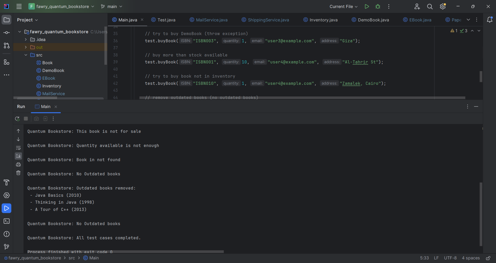

Quantum Bookstore is a Java-based system for managing an online bookstore. It supports:
   - Paper Books, EBooks, and Demo Books.
   - Adding books with details (ISBN, title, author, year, price).
   - Buying books if available and update the stock. 
   - Removing outdated books older than a set number of years.

